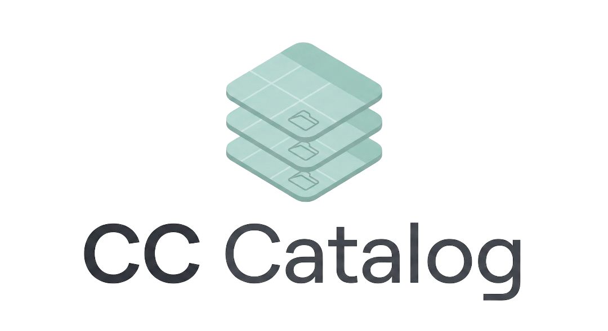

<p align="center">
  
</p>

# CC Catalog (CCCC)

CC Catalog is a specialized tool for The Sims content creators and curators to manage Custom Content (CC) credits efficiently. It automates identifying creators and items from ZIP files and generates formatted markdown reports.

## 🚀 Key Features

- 📂 **Hierarchical Organization**: Support for nested sets (subfolders). Organize your library by year, theme, or collection with parent/child relationships.
- 📁 **Enhanced ZIP Scanning**: Intelligent import logic that identifies creators and sets. 
    - **Duplicate Prevention**: Checks across the entire creator library to avoid importing the same item twice.
    - **Smart Sorting**: Files in root or unknown structures are automatically moved to an "Unsorted" category.
- 📝 **Social-Ready Reports**: Generate credit lists formatted specifically for **Patreon** and **X (Twitter)**.
    - **Auto-Hyperlinks**: Set names are automatically converted to clickable links if Patreon/Website URLs are available.
    - **Rich Aesthetics**: Uses emojis (📁, 📦) and clean Markdown indentation for a professional look.
- 👤 **Advanced Library Manager**: Edit metadata (Patreon, Website, Social links) for creators and individual sets directly.
- 🎨 **Premium Glass UI**: A stunning "glassy" interface with Windows native **Acrylic/Mica** support and customizable accent colors.
- 🧠 **Fuzzy Creator Matching**: Uses Levenshtein distance to detect similar creator names (e.g., "Felixand" vs "Felixandre") to prevent redundant entries.
- 🗃️ **Robust Persistence**: Local storage using SQLite with **Drizzle ORM** for high-performance data management.

## 💻 Technology Stack

- **Framework**: Electron + Vite
- **Frontend**: React, Vanilla CSS (Glassmorphism), Lucide React
- **Database**: SQLite (via `better-sqlite3`) + **Drizzle ORM**
- **Utilities**: `adm-zip` for archive processing, `fuse.js` for selection

## 🏁 Getting Started

### Prerequisites

- [Node.js](https://nodejs.org/) (Latest LTS recommended)
- [npm](https://www.npmjs.com/)

### Installation

1. Clone the repository:
   ```bash
   git clone https://github.com/devbrunoflorian/CCCC.git
   cd CCCC
   ```

2. Install dependencies:
   ```bash
   npm install
   ```

3. Run in development mode:
   ```bash
   npm run dev
   ```

### Building for Production

To create a Windows installer:
```bash
npm run dist
```

## 🛠️ How it Works

The tool analyzes ZIP files looking for creator signatures and folder patterns:
- `Creator/SetName/ItemName.package`
- `Mods/Creator/SetName/ItemName.package`

During scanning, if a name is similar to one already in your database, CC Catalog will prompt you to confirm if it's a new creator or a variations of an existing one.

## ✅ Completed & Recent Updates

- [x] **Nested Sets**: Drag and drop support to create folder hierarchies.
- [x] **Report V2**: Visual-first markdown generation with emojis and links.
- [x] **Metadata Sync**: Persistent saving of Patreon/Website URLs with auto-sinc.
- [x] **Global Duplicate Filter**: Prevents same-file imports across all sets of a creator.
- [x] **Glass Theme**: Native Windows transparency effects and custom tinting.
