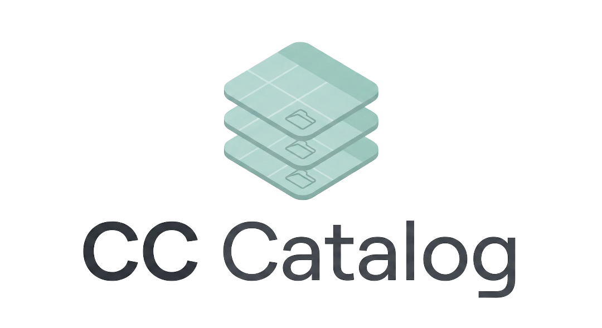

<p align="center">
  
</p>

# CC Catalog (CCCC)

[](README.md)
[](README.pt-br.md)

O CC Catalog é uma ferramenta especializada para criadores e curadores de conteúdo de The Sims gerenciarem créditos de Custom Content (CC) de forma eficiente. Ele automatiza a identificação de criadores e itens a partir de arquivos ZIP e gera relatórios formatados em markdown.

## 💝 Uma Dedicatória Especial (Por que eu fiz isso?)

Este projeto nasceu inteiramente do amor. Eu construí o CC Catalog especificamente para ajudar minha namorada incrível a gerenciar seus Custom Contents com facilidade. Ver o quanto ela gastava de tempo organizando arquivos e procurando os créditos de criadores me inspirou a codificar uma solução apenas para ela.

Tudo aqui, cada funcionalidade, cada clique, cada linha de código, foi feito para tornar a vida dela um pouco mais fácil e o jogo dela um pouco mais divertido. Eu te amo muito! ❤️

Se esta ferramenta acabar ajudando mais alguém na comunidade do The Sims a organizar sua biblioteca, isso é maravilhoso! Aproveitem. Mas o seu verdadeiro propósito e o maior valor disso sempre será o sorriso de quem eu amo.

## 🚀 Funcionalidades Principais

- 📂 **Organização Hierárquica**: Suporte para sets aninhados (subpastas). Organize sua biblioteca por ano, tema ou coleção com relações pai/filho. Mova sets entre criadores facilmente via drag-and-drop.
- 📁 **Escaneamento de ZIP Aprimorado**: Lógica de importação inteligente que identifica criadores e sets. 
    - **Prevenção de Duplicatas**: Verifica toda a biblioteca do criador para evitar a importação do mesmo item duas vezes.
    - **Ordenação Inteligente**: Arquivos na raiz ou com estruturas desconhecidas são movidos automaticamente para uma categoria "Não Selecionados".
- 📝 **Relatórios Prontos para Redes Sociais**: Gera listas de créditos formatadas especificamente para **Patreon** e **X (Twitter)**.
    - **Links Automáticos**: Nomes de sets são convertidos em links clicáveis se as URLs de Patreon/Website estiverem disponíveis.
    - **Patreon HTML Mode**: Novo botão "Copy HTML" que gera links em rich-text prontos para colar diretamente no editor do Patreon.
    - **Priorização de Links**: URLs do Patreon agora têm precedência automática sobre URLs gerais de Website para criadores e sets.
- 🕒 **Organização de Histórico**: Organize seus scans passados em pastas personalizadas. Arraste e solte itens do histórico para manter seu espaço de trabalho limpo.
- 🛡️ **Estabilidade e Segurança**: Sistema integrado de crash reporting.
    - **Log em Arquivo**: Registro automático de erros no sistema de arquivos local.
    - **Error Boundary**: Uma tela de "Pânico" dedicada caso a interface trave, permitindo salvar um relatório no Desktop ou reiniciar o app.
- 🎨 **Interface Glass Premium**: Uma interface "glassy" deslumbrante com suporte nativo a **Acrylic/Mica** do Windows e cores de destaque personalizáveis.
- 🧠 **Busca Difusa de Criadores**: Usa distância Levenshtein para detectar nomes de criadores similares e evitar entradas redundantes.
- 🗃️ **Persistência Robusta**: SQLite com **Drizzle ORM**. O sistema de Exportação/Importação CSV agora suporta e preserva totalmente as hierarquias de pastas.

## 💻 Stack Tecnológica

- **Framework**: Electron + Vite
- **Frontend**: React, Tailwind CSS 4, Lucide React
- **Database**: SQLite (via `better-sqlite3`) + **Drizzle ORM**
- **Utilitários**: `adm-zip` para processamento de arquivos, `fuse.js` para seleção

## 🏁 Começando

### Pré-requisitos

- [Node.js](https://nodejs.org/) (Última versão LTS recomendada)
- [npm](https://www.npmjs.com/)

### Instalação

1. Clone o repositório:
   ```bash
   git clone https://github.com/devbrunoflorian/CC-Catalog.git
   cd CC-Catalog
   ```

2. Instale as dependências:
   ```bash
   npm install
   ```

3. Execute em modo de desenvolvimento:
   ```bash
   npm run dev
   ```

### Build para Produção

Para criar um instalador Windows:
```bash
npm run dist
```

## 🛠️ Como Funciona

A ferramenta analisa arquivos ZIP procurando por assinaturas de criadores e padrões de pastas:
- `Criador/NomeDoSet/NomeDoItem.package`
- `Criador/NomeDoSet/SubPasta/NomeDoItem.package`
- `Mods/Criador/NomeDoSet/NomeDoItem.package`

Durante o escaneamento, se um nome for similar a um já existente no banco de dados, o CC Catalog perguntará se é um novo criador ou uma variação de um existente.

## 🔮 Roadmap & Visão Futura

Estamos em constante evolução. Confira nossa página de [Implementações Futuras](FUTURE_IMPLEMENTATIONS.md) page for upcoming technical proposals, including our **Content Hash Identity System** (Deterministic SHA-256 Identification).


## ✅ Atualizações Recentes

- [x] **Crash Reporting**: Log em arquivo e Error Boundary na UI com suporte a "Salvar no Desktop".
- [x] **Pastas de Histórico**: Organize o histórico de scans em uma estrutura de pastas lógica.
- [x] **Sets Aninhados**: Suporte a drag and drop para criar hierarquias de pastas e reatribuir sets a diferentes criadores.
- [x] **Relatório V2**: Geração de markdown & HTML visual com links de Patreon priorizados.
- [x] **Rich Clipboard API**: Suporte para cópia em `text/html` para contornar limitações do editor do Patreon.
- [x] **CSV com Hierarquia**: Exportação e Importação agora preservam a estrutura de pastas aninhadas.
- [x] **Tema Glass**: Efeitos de transparência nativos do Windows e tintura customizada.
